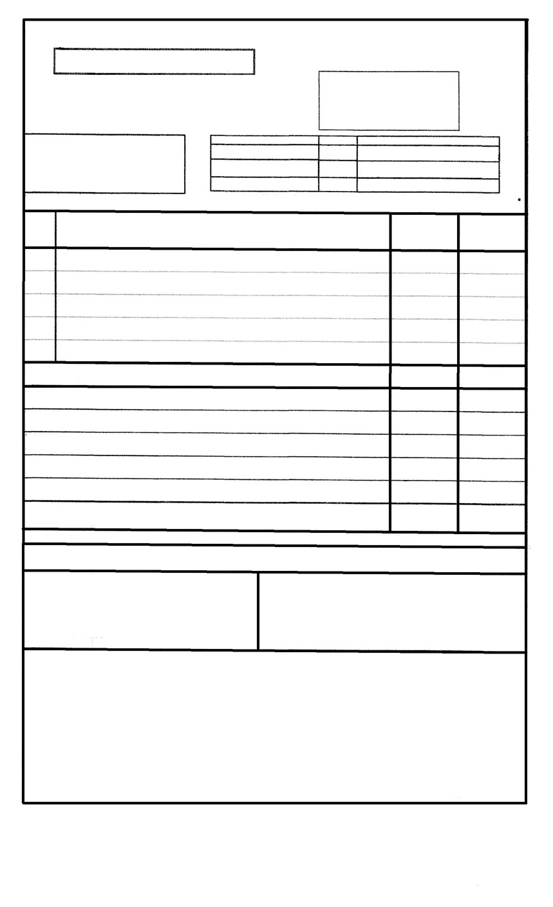
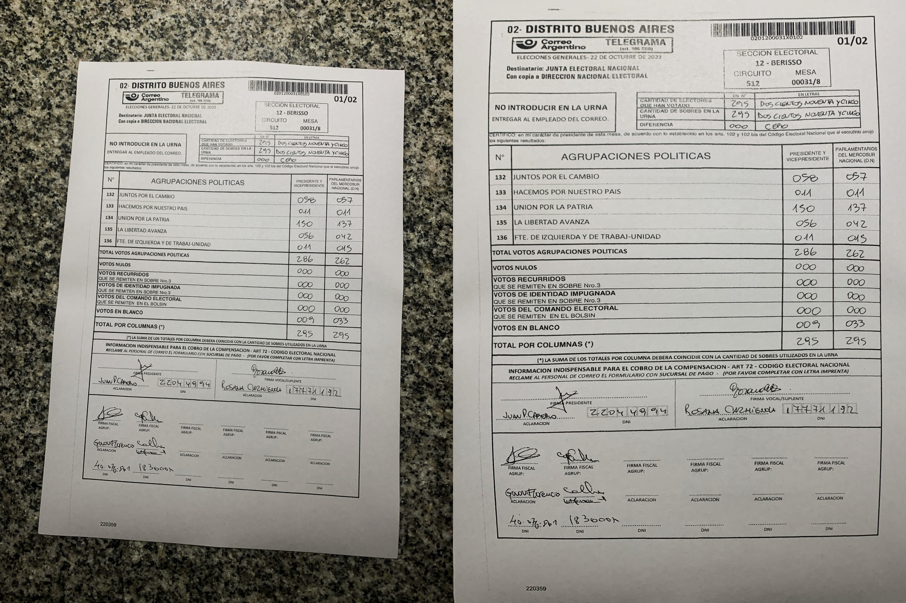
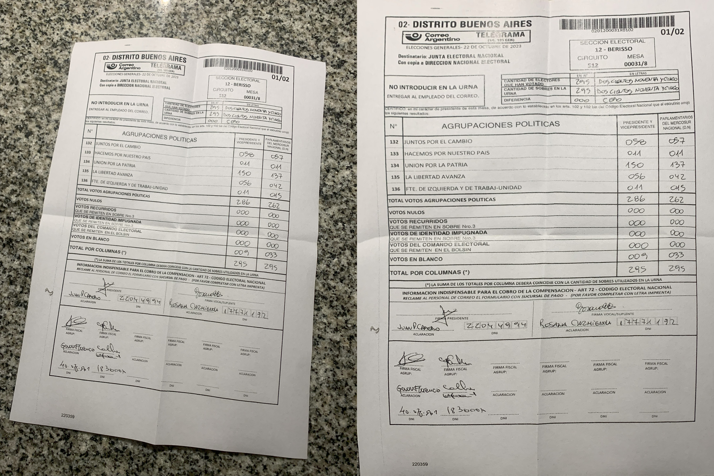
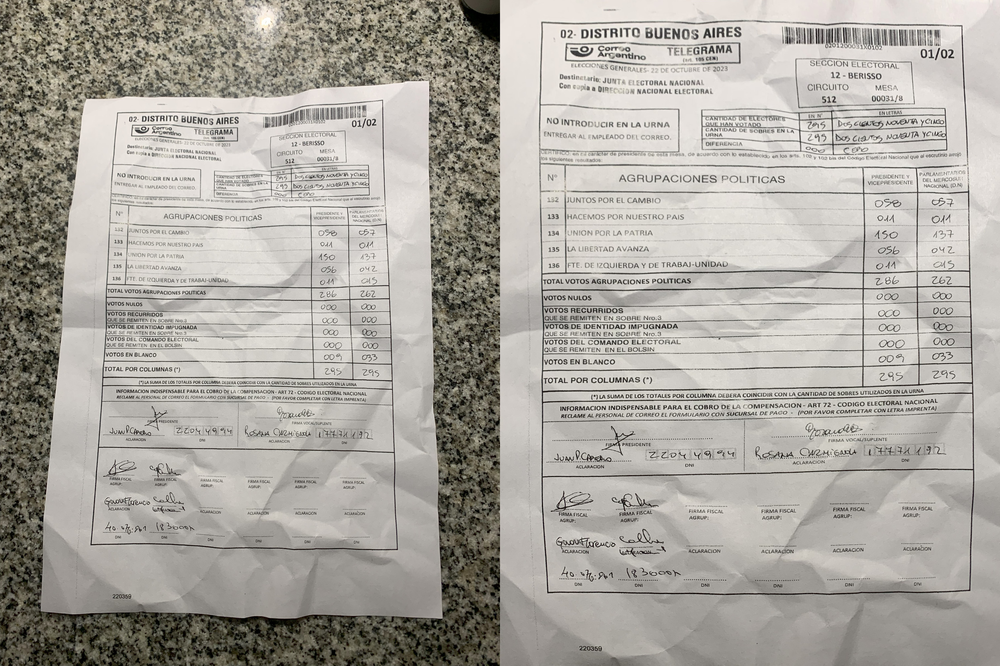

# Alineamiento de telegramas y fotos de certificados de fiscales

Este proyecto tiene por propósito alinear automáticamente los telegramas y fotografías de certificados de fiscales a una plantilla, para facilitar el reconocimiento automático de caracteres.

## Instalación 

Recomendamos usar el Devcontainer provisto:

- Instalar [Docker](https://www.docker.com/) y [VS Code](https://code.visualstudio.com/)
- Instalar la extensión VS Code Devcontainer `ms-vscode-remote.remote-containers`
- Clonar el repositorio:

  git clone https://github.com/FelixHertlein/inv3d-model.git

- Apretar `F1` y elegir `Dev Containers: Rebuild and Reopen Container`.
- Asegurarse de hacer funcionar CUDA en el Docker.
- Dentro del contenedor, ejecutar:

      CUDA_VISIBLE_DEVICES=1 python3 /workspaces/safe-ocr-alignment/ejemplo.py

## Resultados

Para la plantilla:

Un alineamiento de un comprobante en buenas condiciones (mejor caso):

Un alineamiento de un comprobante doblado y vuelto a abrir (caso de dificultad media):

Un alineamiento de un comprobante apretujado y estirado (peor caso):

