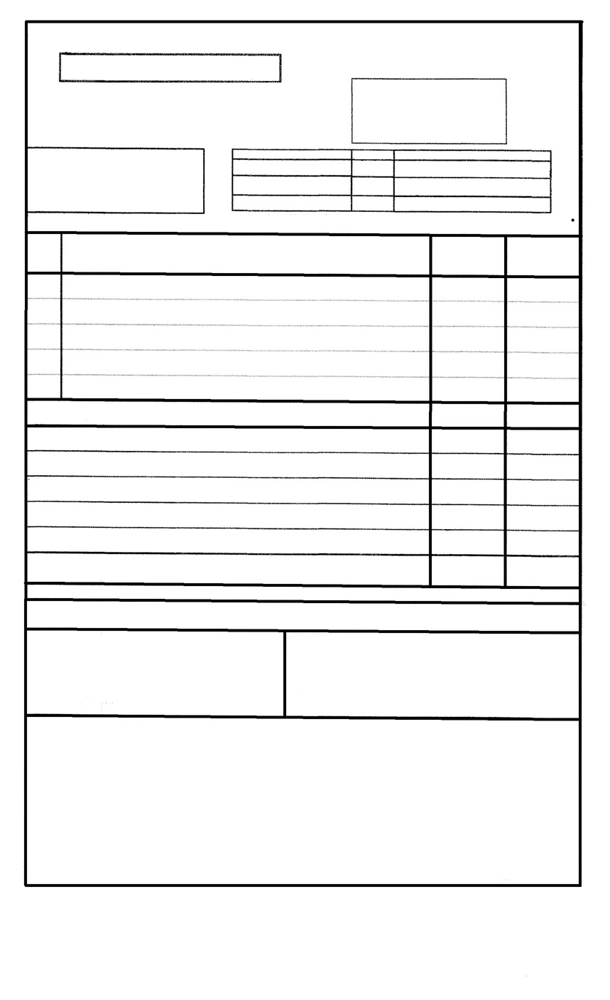
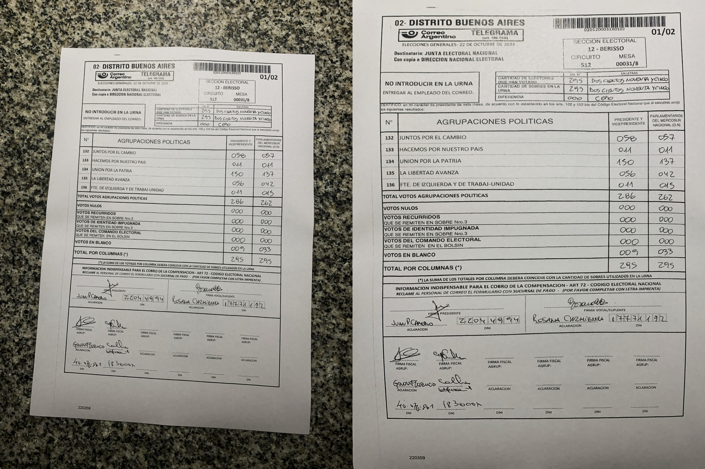
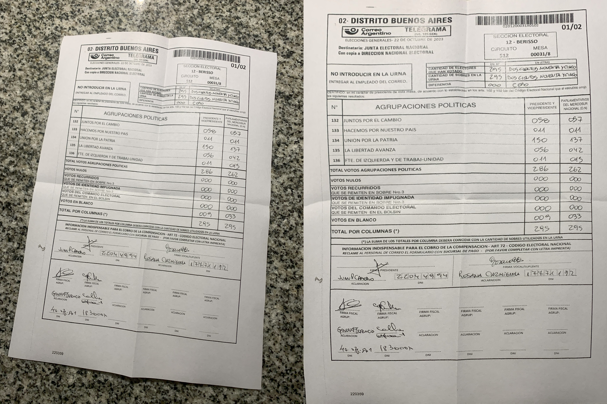
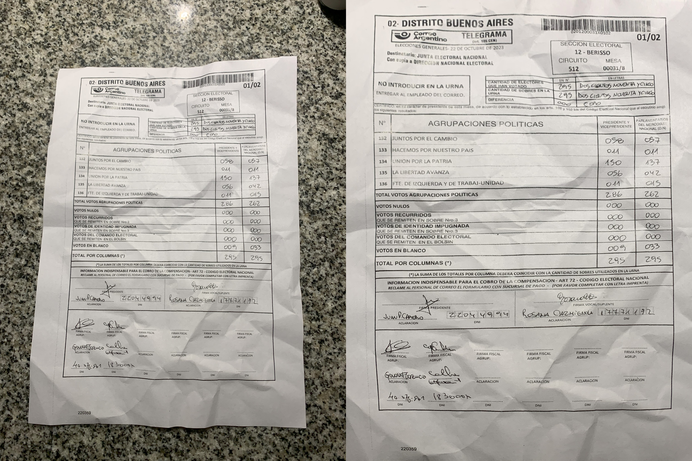

# Alineamiento de fotos de comprobantes de fiscales y telegramas de mesa

Este repositorio describe un proceso para alinear automáticamente las fotografías de comprobantes de fiscales y telegramas de mesa, para facilitar el reconocimiento automático de caracteres.

## Herramientas

* El proyecto https://github.com/FelixHertlein/inv3d-model.
* ImageMagick para mejorar el contraste de las imágenes

## Pasos

* Disponer de una máquina con Ubuntu 22.04.
* Asegurarse que CUDA esté instalado:

    sudo apt install nvidia-cuda-toolkit nvidia-cuda-toolkit-gcc

* Asegurarse de que [Docker](https://www.docker.com) esté instalado.
* Asegurarse de que [VSCode](https://code.visualstudio.com) esté instalado.
* Seguir los pasos en https://github.com/FelixHertlein/inv3d-model.
* En el contendor Docker, crear la carpeta `/workspaces/inv3d-model/input/elecciones`.
* En esa carpeta, colocar todas las imágenes a ser alineadas. Añadirles el prefijo `image-`. Preacondicionar las imágenes con ImageMagick para mejorar el contraste.
* En la misma carpeta, colocar, por cada imágen, la imagen de la plantilla con el prefijo `template-` y el nombre de la imagen. Un ejemplo de una plantilla:

* En el contenedor Docker, ejecutar el comando:

    python3 /workspaces/inv3d-model/inference.py --model geotr_template_large@inv3d --dataset elecciones

* Las imagenes se recuperan en la carpeta `/workspaces/inv3d-model/output`. En una NVIDIA 1080Ti, el proceso tarda aproximadamente 1 s por imagen.

## Resultados

* Un alineamiento de un comprobante en buenas condiciones (mejor caso):

* Un alineamiento de un comprobante doblado y vuelto a abrir (caso medio):

* Un alineamiento de un comprobante apretujado y estirado (peor caso):

